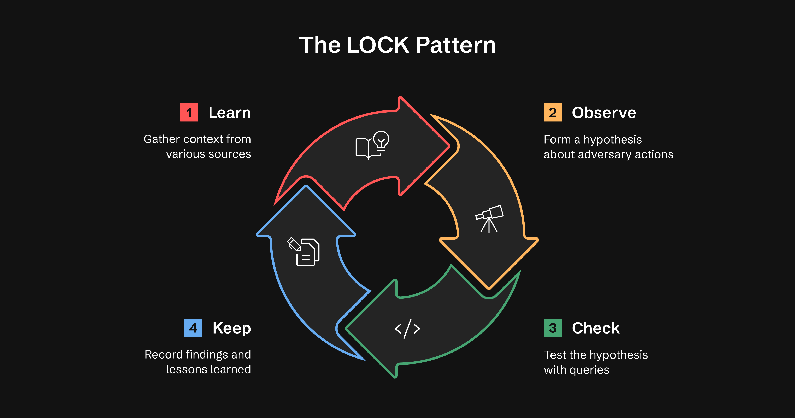

# The LOCK Pattern

Every threat hunt follows the same basic loop: **Learn → Observe → Check → Keep**.

ATHF formalizes that loop with the **LOCK Pattern**, a lightweight structure that is readable by both humans and AI tools.

**Why LOCK?** It's small enough to use and strict enough for agents to interpret.



## The Four Phases

### Learn: Gather Context

Gather context from threat intelligence, alerts, or anomalies.

**Example:**
> "We received CTI indicating increased use of Rundll32 for execution (T1218.011)."

**What to include:**

- Threat intelligence that motivated the hunt
- Recent incidents or alerts
- Available data sources (Sysmon, EDR, security logs)
- MITRE ATT&CK techniques if known

### Observe: Form Hypothesis

Form a hypothesis about what the adversary might be doing.

**Example:**
> "Adversaries may be using Rundll32 to load unsigned DLLs to bypass security controls."

**What to include:**

- Specific adversary behavior you're looking for
- Why this behavior is suspicious
- What makes it detectable
- Expected indicators or patterns

### Check: Test Hypothesis

Test the hypothesis using bounded queries or scripts.

**Example (Splunk):**

```spl
index=winlogs EventCode=4688 CommandLine="*rundll32*" NOT Signed="TRUE"
```

**What to include:**

- The actual query or detection logic
- Data source and time range used
- Query constraints (time bounds, result limits)
- Any filtering or correlation logic

### Keep: Record Findings

Record findings and lessons learned.

**Example:**
> "No evidence of execution found in the past 14 days. Query should be expanded to include encoded commands next run."

**What to include:**

- A verdict for every result (see below)
- Lessons learned
- Next steps or follow-up actions
- Links to related hunts

**Verdicts:** "found / not found" throws away the interesting middle. ATHF records one of five verdicts per result:

| Verdict | Meaning | Where it goes |
|---------|---------|---------------|
| `confirmed` | Malicious activity established — telemetry **plus** independent confirmation | `findings` |
| `suspected` | Telemetry evidence only, nothing independent | `findings` |
| `attempted_not_vulnerable` | The behavior happened; the named control held | `ruled_out` |
| `benign` | Explained as legitimate activity | `ruled_out` |
| `inconclusive` | Not enough telemetry to decide | `ruled_out` |

Two rules carry the weight:

1. **Telemetry alone never reaches `confirmed`.** A query showing the behavior is what surfaced it, not proof of what happened. Getting to `confirmed` takes something outside the log corpus — a controlled reproduction in an attack range, host-level forensic artifacts, or a configuration review. Otherwise the verdict is `suspected`, and that's a complete answer.
2. **`attempted_not_vulnerable` and `benign` belong in `ruled_out`, never `findings`.** A hunt that proves three controls held has produced real output. The old TP/FP vocabulary erased that distinction by filing "we watched an attack get blocked" under the same label as "nothing was there."

Full field reference: [FORMAT_GUIDELINES.md](../hunts/FORMAT_GUIDELINES.md) → The Verdict Ladder.

## Example Hunt Using LOCK

```markdown
# H-0031: Detecting Remote Management Abuse via PowerShell and WMI

**Learn**
Incident response from a recent ransomware case showed adversaries using PowerShell remoting and WMI to move laterally between Windows hosts.
These techniques often bypass EDR detections that look only for credential theft or file-based artifacts.
Telemetry sources available: Sysmon (Event IDs 1, 3, 10), Windows Security Logs (Event ID 4624), and EDR process trees.

**Observe**
Adversaries may execute PowerShell commands remotely or invoke WMI for lateral movement using existing admin credentials.
Suspicious behavior includes PowerShell or wmiprvse.exe processes initiated by non-admin accounts or targeting multiple remote systems in a short time window.

**Check**
index=sysmon OR index=edr
(EventCode=1 OR EventCode=10)
| search (Image="*powershell.exe" OR Image="*wmiprvse.exe")
| stats count dc(DestinationHostname) as unique_targets by User, Computer, CommandLine
| where unique_targets > 3
| sort - unique_targets

**Keep**
Detected two accounts showing lateral movement patterns:
- `svc_backup` executed PowerShell sessions on five hosts in under ten minutes
- `itadmin-temp` invoked wmiprvse.exe from a workstation instead of a jump server

`svc_backup` → `benign` (ruled_out): legitimate Veeam backup automation, matched the nightly change window.
`itadmin-temp` → `suspected` (findings): PowerShell remoting from a workstation instead of the jump server. Telemetry only — no host triage yet, so not `confirmed`. Account disabled pending review.

Next iteration: expand to include remote registry and PSExec telemetry for broader coverage.
```

**See full hunt examples:**
- [H-0001: macOS Information Stealer Detection](../hunts/production/2026/Q1/H-0001.md) - Complete hunt with YAML frontmatter, detailed LOCK sections, query evolution, and results
- [H-0002: Linux Crontab Persistence Detection](../hunts/production/2026/Q1/H-0002.md) - Multi-query approach with behavioral analysis
- [H-0003: AWS Lambda Persistence Detection](../hunts/production/2026/Q1/H-0003.md) - Cloud hunting with CloudTrail correlation
- [Hunt Showcase](../../../SHOWCASE.md) - Side-by-side comparison of all three hunts

## Best Practices

**For Learn:**

- Reference specific threat intelligence or incidents
- List available data sources
- Include MITRE ATT&CK technique IDs

**For Observe:**

- Be specific about the behavior you're hunting
- Explain why it's suspicious
- State what makes it detectable

**For Check:**

- Always include time bounds in queries
- Limit result sets to avoid expensive operations
- Document the query language (Splunk, KQL, SQL, etc.)

**For Keep:**

- Assign a verdict to every result, and don't reach for `confirmed` without confirmation outside the logs
- Record what your controls stopped — `attempted_not_vulnerable` is a finding-grade result
- Document what worked and what didn't
- Include next steps for iteration
- Link to related hunts

## Why LOCK Works

**Without LOCK:** Every hunt is a fresh tab explosion.

**With LOCK:** Every hunt becomes part of the memory layer.

By capturing every hunt in this format, ATHF makes it possible for AI assistants to recall prior work, generate new hypotheses, and suggest refined queries based on past results.

## Templates

See [templates/](../templates/) for ready-to-use LOCK hunt templates.
